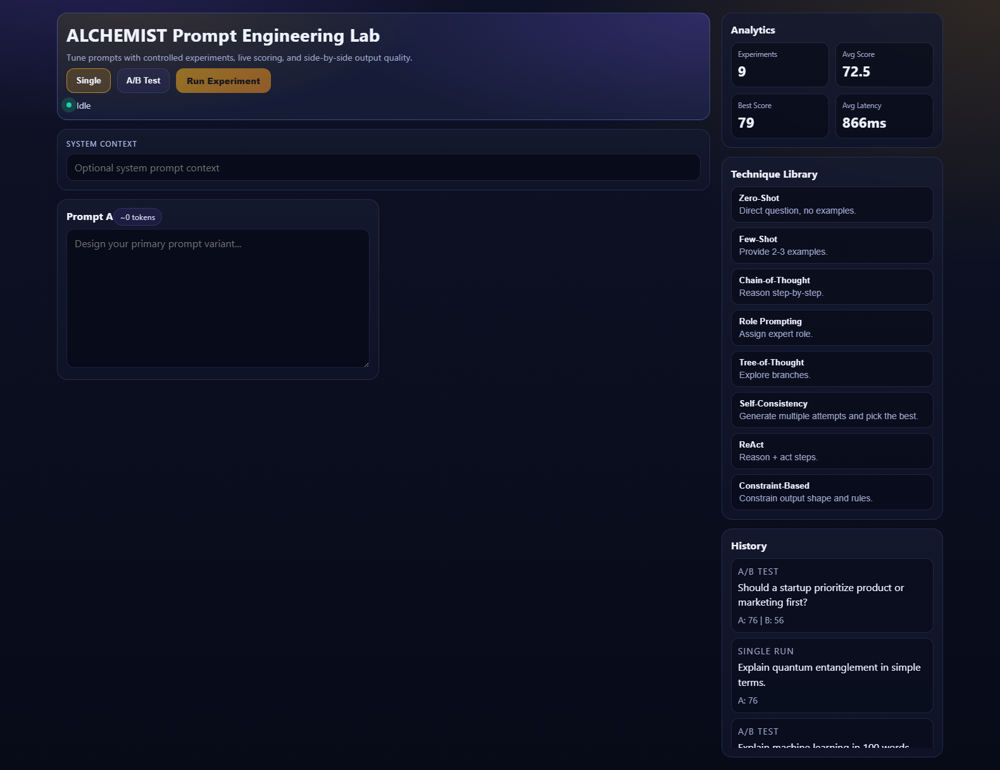
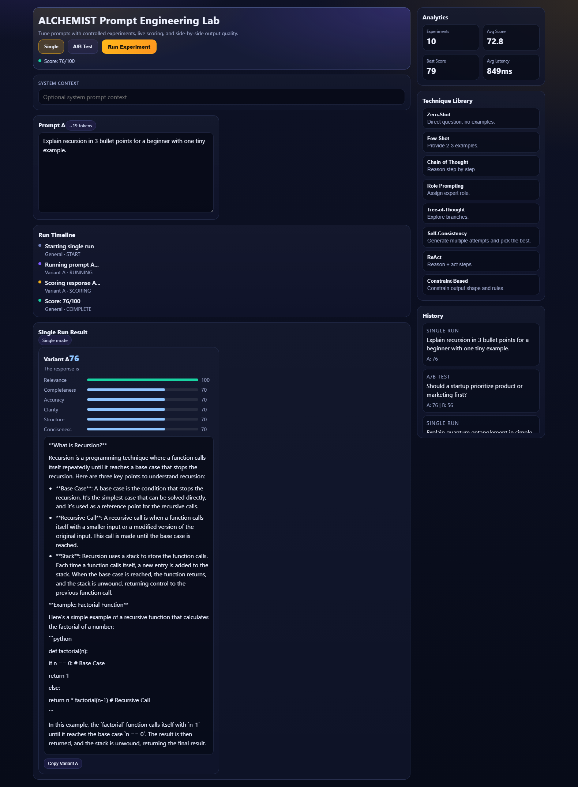
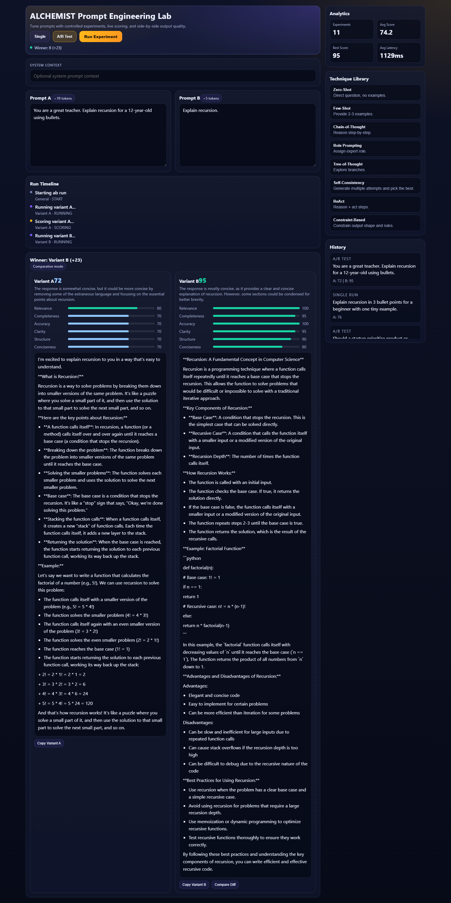
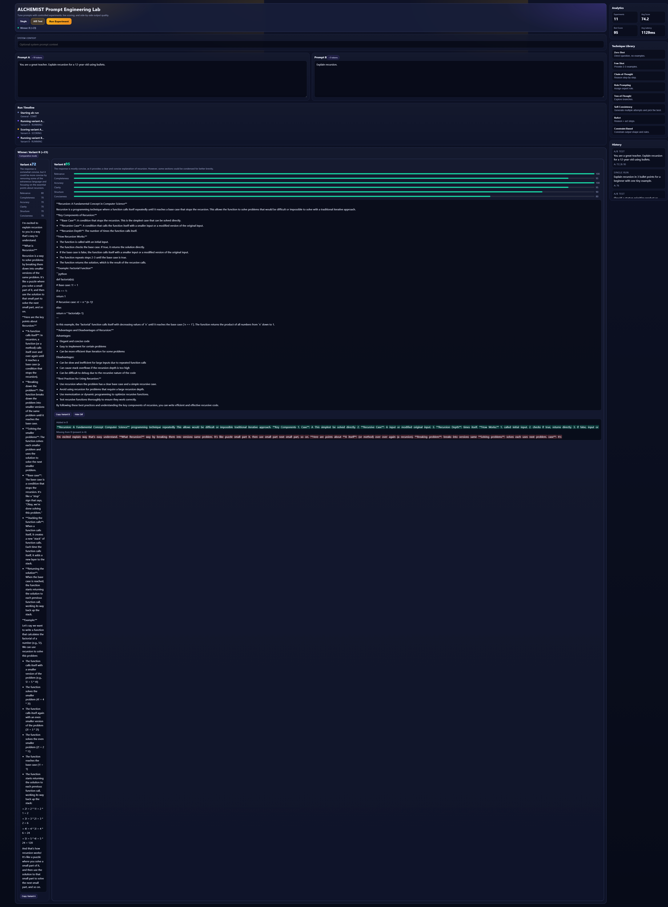

<div align="center">

# ⚗️ ALCHEMIST

### Prompt Engineering Lab — A/B Prompt Intelligence With Live Scoring, Diff, and Timeline UX

[](https://www.python.org/)
[](https://fastapi.tiangolo.com/)
[](https://docs.pydantic.dev/)
[](https://react.dev/)
[](https://groq.com/)
[](https://github.com/crastatelvin/alchemist-prompt-lab/actions)
[](LICENSE)

<br/>

> **ALCHEMIST** is a production-style prompt experimentation platform. Write and compare prompts in single/A-B modes, get weighted quality scores across six dimensions, track live run progress, inspect output diffs, and build a repeatable prompt optimization workflow in a premium animated UI.

<br/>

   

</div>

---

## 📋 Table of Contents

- [Overview](#-overview)
- [Application Preview](#-application-preview)
- [Features](#-features)
- [Architecture](#-architecture)
- [Tech Stack](#-tech-stack)
- [Project Structure](#-project-structure)
- [Installation](#-installation)
- [Usage](#-usage)
- [API Reference](#-api-reference)
- [Configuration](#-configuration)
- [Testing \& CI](#-testing--ci)
- [Security Notes](#-security-notes)
- [Design Decisions](#-design-decisions)
- [License](#-license)

---

## 🧠 Overview

ALCHEMIST focuses on a real modern workflow: scientific prompt optimization.
The backend executes and scores experiments with persistence + safeguards, while the React frontend provides an immersive lab interface with structured result viewing.

Users can:

- Run **single** prompt experiments with full quality scoring
- Run **A/B prompt comparisons** and get winner + margin
- Track **live run stages** via WebSocket timeline updates
- Inspect **dimension bars** (`relevance`, `completeness`, `accuracy`, `clarity`, `structure`, `conciseness`)
- Use **copy actions and token-level diff hints** for A/B output comparison
- Persist and revisit experiment history + aggregate stats

---

## 🖼️ Application Preview

<div align="center">

### 1) Landing State



<br/>

### 2) Single Run Result



<br/>

### 3) A/B Comparison Result



<br/>

### 4) Diff + Timeline View



<br/>

### 5) Analytics + History Depth


</div>

---

## ✨ Features

| Feature | Description |
|---|---|
| ⚗️ **Single + A/B Prompt Lab** | Execute one prompt or compare two variants in the same flow |
| 📊 **Weighted 6-Dimension Scoring** | Relevance, completeness, accuracy, clarity, structure, conciseness |
| 🧠 **AI + Fallback Scoring Logic** | Groq scoring pipeline with resilient heuristic fallback |
| 📡 **Live Timeline UX** | WebSocket-backed run-stage updates (`start`, `running`, `scoring`, `complete`) |
| 🧩 **Structured Output Rendering** | Output text is normalized into readable paragraphs/lists |
| 🔍 **A/B Diff Interaction** | Compare added/removed token hints between variant outputs |
| 🧪 **Technique Library** | Apply prompt engineering patterns to accelerate experimentation |
| 🔐 **Optional API Key Protection** | Enable backend route protection using `API_KEY` |
| ⏱️ **Rate Limiting** | Request limiter middleware for safer runtime behavior |
| 💾 **SQLite Persistence + Alembic** | Experiment storage, trends, and migration support |
| 🎨 **Premium Animated UI** | Glass panels, micro-interactions, score motion, polished hierarchy |

---

## 🏗️ Architecture

```
┌───────────────────────────────────────────────────────────────────┐
│                     React Premium Lab UI                          │
│                                                                   │
│  PromptEditors ─► Run Controls ─► ResultPanel + Diff + ScoreBars  │
│       │                 │                   │                     │
│       └──────── REST /run + WS /ws ◄────────┘                     │
│                         │                                         │
│                  Analytics + History + Techniques                 │
└──────────────────────────────┬────────────────────────────────────┘
                               │
                               ▼
┌───────────────────────────────────────────────────────────────────┐
│                          FastAPI Backend                          │
│                                                                   │
│ Middleware: CORS + request-id logging + optional API-key auth     │
│                                                                   │
│ /run ─► experiment_runner.py ─► groq_service.py                   │
│      └► prompt_scorer.py      └► repository.py + SQLAlchemy       │
│                                                                   │
│ /stats, /experiments, /techniques                                 │
│ /ws   ─► broadcast progress timeline                              │
│                                                                   │
│ SQLite + Alembic for persistence and migrations                   │
└───────────────────────────────────────────────────────────────────┘
```

---

## 🛠️ Tech Stack

| Layer | Technology |
|---|---|
| **Backend** | FastAPI, Pydantic 2, Uvicorn, Python 3.11+ |
| **Provider** | Groq Chat Completions API |
| **Persistence** | SQLite + SQLAlchemy + Alembic |
| **Frontend** | React 18, Vite, Framer Motion, custom premium CSS |
| **Transport** | REST + WebSocket |
| **Testing** | Pytest (backend), Vitest (frontend) |
| **CI** | GitHub Actions (`.github/workflows/ci.yml`) |
| **Containerization** | Docker + docker-compose |

---

## 📁 Project Structure

```
alchemist-prompt-lab/
│
├── backend/
│   ├── app/
│   │   ├── main.py
│   │   ├── api/routes.py
│   │   ├── core/
│   │   │   ├── config.py
│   │   │   ├── security.py
│   │   │   └── logging_utils.py
│   │   ├── db/
│   │   │   ├── database.py
│   │   │   ├── models.py
│   │   │   └── schemas.py
│   │   └── services/
│   │       ├── groq_service.py
│   │       ├── prompt_scorer.py
│   │       ├── experiment_runner.py
│   │       ├── technique_library.py
│   │       └── repository.py
│   ├── alembic/
│   ├── tests/
│   ├── requirements.txt
│   └── .env.example
│
├── frontend/
│   ├── src/
│   │   ├── pages/LabPage.jsx
│   │   ├── components/
│   │   ├── hooks/useExperiment.js
│   │   ├── services/api.js
│   │   └── styles/globals.css
│   ├── tests/
│   └── package.json
│
├── docs/
│   └── screenshots/
│
├── .github/workflows/ci.yml
├── DECISIONS.md
├── LICENSE
└── README.md
```

---

## 🚀 Installation

### 1) Clone

```bash
git clone https://github.com/crastatelvin/alchemist-prompt-lab.git
cd alchemist-prompt-lab
```

### 2) Backend

```bash
cd backend
python -m venv venv
venv\Scripts\activate
pip install -r requirements.txt
copy .env.example .env
alembic upgrade head
uvicorn app.main:app --reload --port 8000
```

### 3) Frontend

In a second terminal:

```bash
cd frontend
npm install --legacy-peer-deps
npm run dev -- --host 127.0.0.1 --port 5173
```

Frontend: `http://127.0.0.1:5173`  
Backend docs: `http://127.0.0.1:8000/docs`

---

## 💻 Usage

1. Open the lab UI
2. Write Prompt A (and Prompt B in A/B mode)
3. Click **Run Experiment**
4. Review:
   - Winner and margin
   - Dimension score bars
   - Structured output
   - Diff insights (A/B mode)
   - Timeline updates
5. Reuse a technique from Technique Library and iterate

Quick API smoke test:

```bash
curl -X GET http://127.0.0.1:8000/health
```

---

## 📡 API Reference

| Method | Endpoint | Description |
|---|---|---|
| `GET` | `/` | Service status |
| `GET` | `/health` | Health check |
| `GET` | `/ready` | Readiness check |
| `POST` | `/run` | Run single or A/B experiment |
| `GET` | `/experiments` | Fetch experiment history |
| `GET` | `/stats` | Fetch aggregate metrics |
| `GET` | `/techniques` | List prompt techniques |
| `GET` | `/techniques/{id}` | Technique detail |
| `WS` | `/ws` | Live experiment progress events |

---

## ⚙️ Configuration

`backend/.env`:

```bash
GROQ_API_KEY=...
GROQ_MODEL=llama-3.1-8b-instant
API_KEY=
APP_ENV=development
DB_URL=sqlite:///./alchemist.db
CORS_ORIGINS=http://localhost:5173,http://127.0.0.1:5173
```

---

## 🧪 Testing & CI

Backend:

```bash
cd backend
pytest tests
```

Frontend:

```bash
cd frontend
npm run lint
npm run test
npm run build
```

Automation screenshots:

```bash
cd frontend
node scripts/take-screenshots.mjs
```

GitHub Actions runs backend tests + frontend lint/test/build on push and PR.

---

## 🔒 Security Notes

- Optional API-key middleware protects API routes when `API_KEY` is set
- CORS origins are explicitly allowlisted via environment config
- Rate limiting is enabled for safer endpoint usage
- Request IDs are logged and echoed for traceability

---

## 🧭 Design Decisions

See [`DECISIONS.md`](./DECISIONS.md) for architecture rationale, including:

- scoring strategy and fallback behavior
- persistence decisions
- request-id observability middleware
- monorepo structure choices

---

## License

This project is licensed under the MIT License. See [LICENSE](./LICENSE).

                    Built by Telvin Crasta · Premium UX · Prompt intelligence

                 ⭐ If ALCHEMIST helped you improve prompts faster, star the repo.
